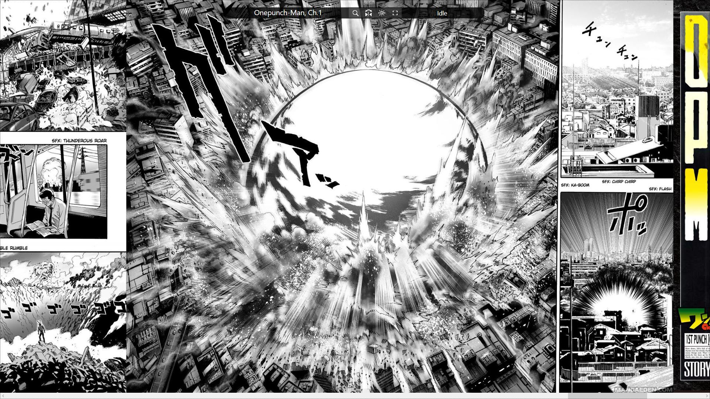

# KittyManga

Are you tired of all the manga websites laying out pages vertically when all our screen are longer horizontally? 

Are you tired of manga scrolling to the right even though most reads right to left?

Are you tired of browsers bumpy scrolling causing you to lose the sentence while scrolling?

This lightweight, portable, manga client fills every inch of your hard earned 34" ultrawide monitor and combines features like background prefetching, night mode, and bookmarks. 

## Controls
Once the client connects with MangaEden, use the search bar at the top to search for a manga. 
Click on a suggestion bellow the search bar or press enter to highlight the top suggestion.
Once the manga loads, click a chapter and begin viewing.

### Additional controls
- Zooming: Right mouse buttom
- Toggle Zooming: Middle mouse button
- Scrolling: Arrow key or mouse wheel
- Fullscreen: F11 or fullscreen button
- Nightmode: Night mode button. Toggles nightmode.
- Read Direction: Read Direction button. Toggles left/right reading. 

## Horizontal viewing experience

## Built with
[Json.NET](https://www.newtonsoft.com/json) - Used for JSON parsing

## Contributing

- Chi Cheng Hsu (me)

## Liscense
This project is licensed under the MIT License. 
